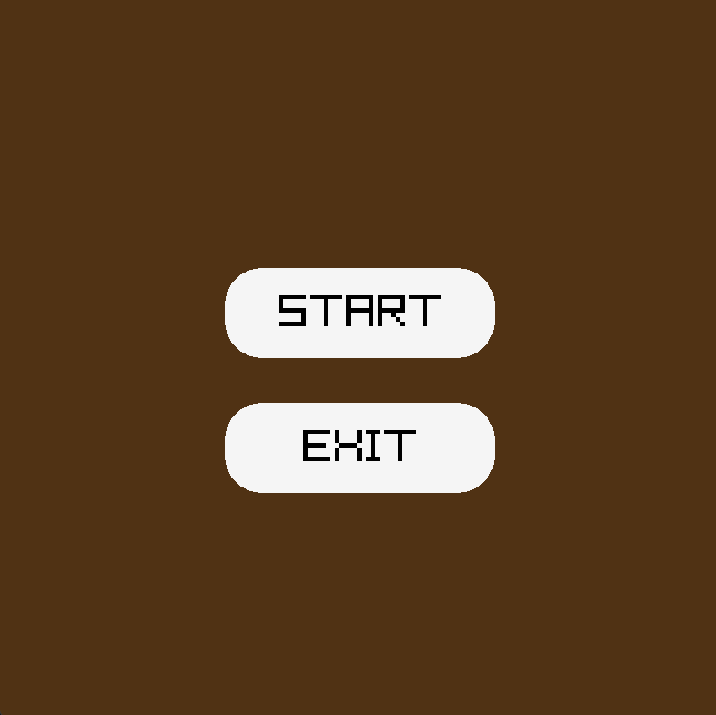
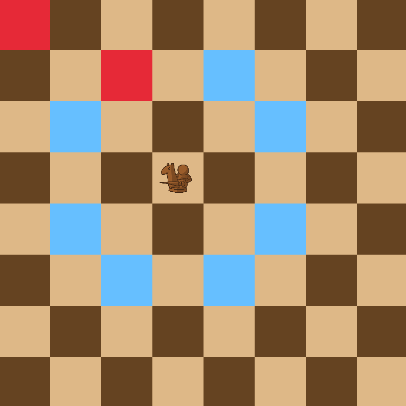
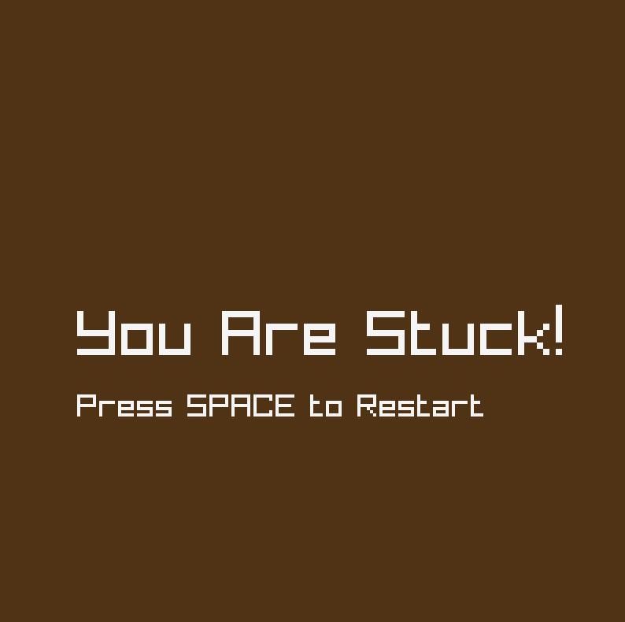

# ♞ Knight Movement Game

A visually engaging knight movement puzzle game built using **Raylib**. The objective is to move the knight across a chessboard without getting stuck — visiting as many tiles as possible using valid knight moves.

## 🎮 Features

- 🧩 Knight can move in L-shaped directions (standard chess knight rules)
- 🔴 Visited tiles marked in red
- 💡 Toggle move suggestions by clicking on the knight
- 🏁 Detects when the knight is stuck
- 🔄 Pause menu with options to **Continue**, **Restart**, or **Exit**
- 🖼️ Textured knight using external image
- 🎨 Smooth UI with hover animations and custom buttons

## 🎮 Controls

| Action               | Key / Mouse Input                  |
|----------------------|------------------------------------|
| Toggle Move Hints    | Left Click on Knight               |
| Move Knight          | Left Click on Highlighted Tile     |
| Pause Menu           | `SPACE` key                        |
| Restart Game         | Press `SPACE` after getting stuck  |
| Continue Game        | Click `CONTINUE` on Pause Menu     |
| Restart from Pause   | Click `RESTART` on Pause Menu      |
| Exit Game            | Click `EXIT` on Menus              |

## Game Preview





## 📦 Requirements

- [Raylib](https://www.raylib.com/) (tested with version 4.5+)
- C++ compiler (like g++, clang++ or MSVC)
- `knight.png` image file placed in the same directory

## 🚀 How to Run

1. Clone the repository:
   ```bash
   git clone https://github.com/YourUsername/Knight-Game.git
   cd KnightGame
